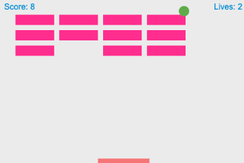

```
## A fun game of Bouncy Ball and Paddle! 
```
#### Player can use a mouse or key board arrows to move the paddle to hit the ball
* Points are accumulated if player successfully taps the ball into the brick wall, deleting the brick! 
* Each player has 3 lives!


Tech Stack:
``` 
HTML
```
``` 
CSS
``` 
``` 
JavaScript 
```





 Game based on this great [tutorial](https://developer.mozilla.org/en-US/docs/Games/Tutorials/2D_Breakout_game_pure_JavaScript/Create_the_Canvas_and_draw_on_it)
